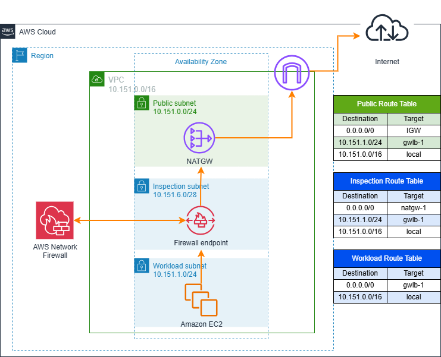

---

---

# AWS Network Firewall - Strict Rule Ordering (Logging Example) - Terraform Sample

This repository contains terraform code to deploy a single VPC with inspection using AWS Network Firewall. Stateful rule groups use **Strict Rule Ordering**, and the end goal of this example is to show how you can log both ALLOWED and DENIED traffic in the same destination directly from Network Firewall - CloudWatch logs is used in this example. 

The resources deployed and the architectural pattern they follow is purely for demonstration/testing purposes.

## Prerequisites

- An AWS account with an IAM user with the appropriate permissions
- Terraform installed

## Code Principles:

- Writing DRY (Do No Repeat Yourself) code using a modular design pattern

## Usage

- Clone the repository
- Edit the variables.tf file in the project root directory. This file contains the variables that are used to configure environment.
- Initialize Terraform using `terraform init`
- Deploy the template using `terraform apply`

**Note**: The default number of Availability Zones to use is 1, although you can change this number in the input variables to a maximum number of 3. To follow best practices, each resource - EC2 instance, NAT Gateway, SSM endpoints, and Network Firewall endpoint - will be created in each Availability Zone. **Keep this in mind** to avoid extra costs unless you are happy to deploy more resources and accept additional costs.

<!-- BEGIN_TF_DOCS -->
## Requirements

| Name | Version |
|------|---------|
|  [terraform](#requirement\_terraform) | ~> 1.1.2 |
|  [aws](#requirement\_aws) | ~> 3.71.0 |

## Providers

No providers.

## Modules

| Name | Source | Version |
|------|--------|---------|
|  [compute](#module\_compute) | ./modules/compute | n/a |
|  [endpoints](#module\_endpoints) | ./modules/endpoints | n/a |
|  [firewall](#module\_firewall) | ./modules/firewall | n/a |
|  [kms](#module\_kms) | ./modules/kms | n/a |
|  [vpc](#module\_vpc) | ./modules/vpc | n/a |

## Resources

No resources.

## Inputs

| Name | Description | Type | Default | Required |
|------|-------------|------|---------|:--------:|
|  [aws\_region](#input\_aws\_region) | AWS Region to create the environment. | `string` | `"eu-west-1"` | yes |
|  [instance\_type](#input\_instance\_type) | Instance type of the instances created. | `string` | `"t2.micro"` | yes |
|  [number\_azs](#input\_number\_azs) | Number of Availability Zones to create resources in the VPC. | `number` | `1` | yes |
|  [project\_identifier](#input\_project\_identifier) | Project Name, used as identifer when creating resources. | `string` | `"anfw-strict-rule"` | yes |
|  [vpcflowlog\_type](#input\_vpcflowlog\_type) | The type of traffic to log in VPC Flow Logs. | `string` | `"ALL"` | yes |

## Outputs

| Name | Description |
|------|-------------|
|  [anfw\_arn](#output\_anfw\_arn) | ARN of the AWS Network Firewall resource created. |
|  [instances\_created](#output\_instances\_created) | List of EC2 instances created in this environment. |
|  [kms\_key\_arn](#output\_kms\_key\_arn) | ARN of the KMS key created. |
|  [vpc\_endpoints](#output\_vpc\_endpoints) | List of VPC endpoints created. |
<!-- END_TF_DOCS -->

## Deployment

### AWS Network Firewall

The AWS Network Firewall Policy is defined in the policy.tf file in the firewall directory. The firewall policy is configured to use Strict Rule Ordering with "Alert All" and "Drop All" as default actions. 3 rules groups are configured:

- One stateless rule group denying any SSH or RDP communication.
- Two stateful rule groups: one allowing ICMP communication, and another one allowing communication with the domains "example.com" and ".amazon.com". 

All the **pass** actions are duplicated with **alert** ones first. That way the alert rule generates first the log (ALLOWED) and later the pass rule allows the communication. As per the default actions, other communication will be DENIED and logged in the same destination (ALERT flow log).

### Logging Configuration

- VPC Flow Logs are configured and sent to a CloudWatch Log group. Amazon S3 can also be used as a logging destination.
- AWS Network firewall logs are also configured - both **ALERT** and **FLOW** - to respective AWS Cloudwatch Log Groups. Amazon S3 or Amazon Kinesis Firehose can also be used as a logging destination.

## Target Architecture

### References

- AWS Reference Architecture - [Inspection Deployment Models with AWS Network Firewall](https://d1.awsstatic.com/architecture-diagrams/ArchitectureDiagrams/inspection-deployment-models-with-AWS-network-firewall-ra.pdf). 
- AWS Documentation - [Evaluation order for stateful rule groups](https://docs.aws.amazon.com/network-firewall/latest/developerguide/suricata-rule-evaluation-order.html)

### Cleanup

Remember to clean up after your work is complete. You can do that by doing `terraform destroy`.

Note that this command will delete all the resources previously created by Terraform.

------

## Security

See [CONTRIBUTING](CONTRIBUTING.md) for more information.

------

## License

This library is licensed under the MIT-0 License. See the [LICENSE](LICENSE) file.